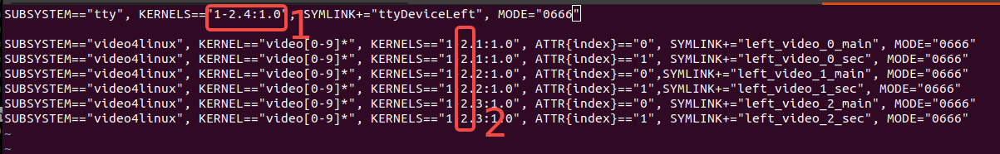
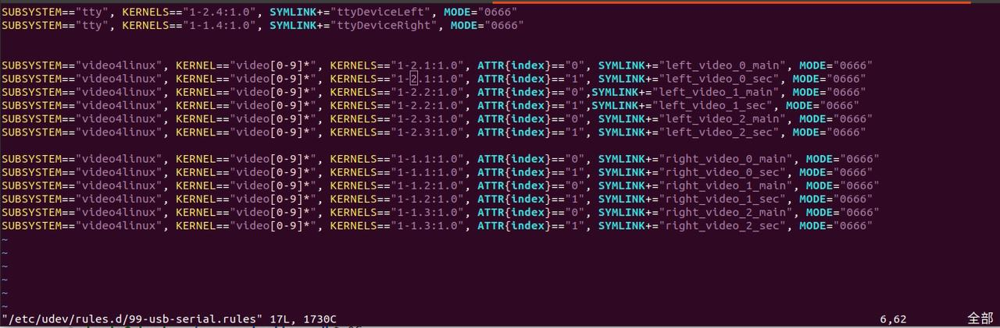
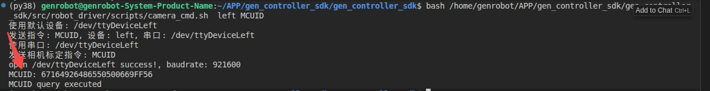

# USB 配置指南

本文说明如何配置 udev 规则，使每个 Gen Finger 的 USB 口映射到固定的串口和相机设备名。

模板文件位于 [config/99-usb-serial.rules](../config/99-usb-serial.rules)。

配置完成后，对应 USB 口可识别 Gen Finger 设备，后续无需再次配置。

[English](usb-setup.md)

## 1 单指 USB 口配置

每只 finger 只需配置 **1 个串口** 和 **1 个相机**（与 Gen Controller 的三相机不同）。

最终配置形式如图。


用户需修改的地方如下。



### 1.1 参数 1 — 串口 KERNELS

```shell
cd /dev && ls | grep ttyUSB
udevadm info -a -n /dev/ttyUSB* | grep -E "KERNELS|DRIVERS"
```

如果获取不到串口，执行：

```shell
sudo apt remove brltty
```

将输出中的**第二个** `KERNELS` 数值配置到参数 1 处：


### 1.2 参数 2 — 相机 KERNELS

```shell
v4l2-ctl --list-devices
```

输出示例：


针对该 USB 的相机执行：

```shell
udevadm info -a -n /dev/video* | grep -E "KERNELS|SUBSYSTEMS"
```

将输出中的**第一个** `KERNELS` 数值配置到参数 2 处：


### 1.3 加载配置

```shell
sudo cp config/99-usb-serial.rules /etc/udev/rules.d/
sudo udevadm control --reload-rules
sudo udevadm trigger
```

单指配置后的默认软链接：

| 设备 | 软链接 |
|------|--------|
| 串口 | `/dev/ttyFingerLeft` |
| 相机 | `/dev/finger_camera_left` |

## 2 双指 USB 口配置

最终配置形式如图所示。



需修改地方：


步骤：

1. 插入**左** finger，按单指方法配置串口与相机；
2. 拔下左 finger，插入**右** finger，再次按单指方法配置；
3. 加载 udev 规则。

双指配置后的默认软链接：

| 设备 | 软链接 |
|------|--------|
| 左 finger 串口 | `/dev/ttyFingerLeft` |
| 左 finger 相机 | `/dev/finger_camera_left` |
| 右 finger 串口 | `/dev/ttyFingerRight` |
| 右 finger 相机 | `/dev/finger_camera_right` |

## 3 多指配置

在 `99-usb-serial.rules` 中按相同方式为每个 finger 添加 1 条串口规则和 1 条相机规则。

## 4 验证设备 ID（可选）

**不要**同时运行 `roslaunch robot_driver single_finger_start.launch`。

```shell
cd src/robot_driver/scripts
bash camera_cmd.sh left MCUID
```

双指配置：

```shell
bash camera_cmd.sh left MCUID
bash camera_cmd.sh right MCUID
```

示例输出：


